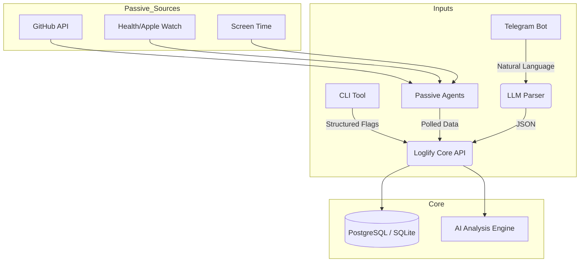

# Loglify

**Frictionless Personal Analytics & Life Logging**

**Loglify** is a unified "Headless" life-logging system designed to minimize the friction of tracking your daily actions. It combines active logging (Natural Language Chat & CLI) with passive tracking (API Aggregators) to create a holistic view of your life.

It doesn't force you into a UI. You log where you live: in your terminal or your chat app.

## 🏗 Architecture

Loglify operates as a central API server that ingests data from three distinct sources.



## ✨ Features

### 1. 💬 Chat-First Logging (Telegram)

Send natural language messages to your bot. Loglify uses an LLM (OpenAI/Claude) to parse intent, extract entities, and structure the data automatically.

* **Input:** *"I just spent 2 hours fixing a bug in the DV website backend."*
* **Log:** `{"action": "Coding", "project": "DV Website", "duration": 120, "tags": ["backend", "bugfix"]}`

### 2. 💻 Hacker's CLI

For when you are already deep in the terminal. A fast, Go/Python-based CLI to log actions without context switching.

* **Command:** `loglify track "Server migration" -t 45m -p urgent`

### 3. 🔌 Passive Aggregators

Why log what can be tracked automatically? Background workers poll external services:

* **GitHub:** Automatically logs commits, PRs, and issues from your tracked repositories.
* **System:** (Optional) Hooks for local uptime or screen time.

### 4. 🧠 AI Daily Review

A nightly cron job analyzes the day's database entries and sends a summary and suggestions to your Telegram.

---

## 🛠 Tech Stack

* **Core:** Python (FastAPI)
* **Database:** PostgreSQL (with `pgvector` for semantic search of logs) or SQLite (for local-first)
* **AI/NLP:** OpenAI API (GPT-4o-mini) or Local LLM (Ollama)
* **Interface:** python-telegram-bot
* **CLI:** Click (Python) or Cobra (Go)

---

## 🚀 Getting Started

### Prerequisites

* Python 3.10+
* Docker (optional)
* OpenAI API Key
* Telegram Bot Token (via @BotFather)

### Installation

1. **Clone the repository**
```bash
git clone https://github.com/makalin/loglify.git
cd loglify

```


2. **Environment Setup**
Copy the example environment file:
```bash
cp .env.example .env

```


*Fill in your `TELEGRAM_TOKEN`, `OPENAI_API_KEY`, and `DATABASE_URL`.*
3. **Install Dependencies**
```bash
pip install -r requirements.txt

```


4. **Run the Server (Core + Bot)**
```bash
uvicorn main:app --reload

```


### Docker Quickstart

```bash
docker-compose up -d --build

```

---

## 📖 Usage Guide

### Via Telegram

Simply chat with your bot.

* **Log a meal:** *"Ate a chicken salad and a soda."* (AI estimates calories/macros).
* **Log work:** *"Meeting with Client X regarding the new design."*
* **Query:** *"How many hours did I code this week?"*

### Via CLI

The CLI sends requests to the running Loglify instance.

```bash
# Basic log
loglify log "Read a book"

# Detailed log
loglify log "Deploying production" --tag work --duration 30m

# Sync Passive Data (Manual Trigger)
loglify sync --github

```

## 🗺 Roadmap

* [ ] **v0.1:** Telegram Bot + Basic SQL Schema.
* [ ] **v0.2:** LLM Parsing Layer (Natural Language -> JSON).
* [ ] **v0.3:** CLI Tool integration.
* [ ] **v0.4:** GitHub API Aggregation.
* [ ] **v1.0:** "Review Mode" (Daily AI summaries).
* [ ] **Future:** Vector Search (RAG) to "Chat with your past self."

## 🤝 Contributing

Pull requests are welcome. For major changes, please open an issue first to discuss what you would like to change.

## 📄 License

[MIT](https://choosealicense.com/licenses/mit/)
