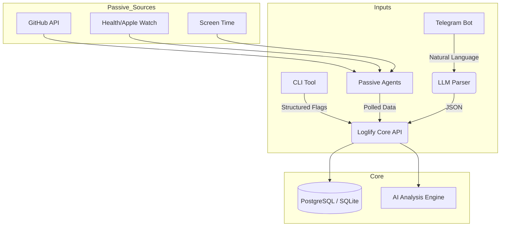

# Loglify

**Frictionless Personal Analytics & Life Logging**

**Loglify** is a unified "Headless" life-logging system designed to minimize the friction of tracking your daily actions. It combines active logging (Natural Language Chat & CLI) with passive tracking (API Aggregators) to create a holistic view of your life.

It doesn't force you into a UI. You log where you live: in your terminal or your chat app.

## 🏗 Architecture

Loglify operates as a central API server that ingests data from three distinct sources.



## ✨ Features

### 1. 💬 Chat-First Logging (Telegram)

Send natural language messages to your bot. Loglify uses an LLM (OpenAI/Claude) to parse intent, extract entities, and structure the data automatically.

* **Input:** *"I just spent 2 hours fixing a bug in the DV website backend."*
* **Log:** `{"action": "Coding", "project": "DV Website", "duration": 120, "tags": ["backend", "bugfix"]}`

### 2. 💻 Hacker's CLI

For when you are already deep in the terminal. A fast, Python-based CLI to log actions without context switching.

* **Command:** `loglify log "Server migration" --duration 45m --project urgent`

### 3. 🔌 Passive Aggregators

Why log what can be tracked automatically? Background workers poll external services:

* **GitHub:** Automatically logs commits, PRs, and issues from your tracked repositories.
* **System:** (Optional) Hooks for local uptime or screen time.

### 4. 🧠 AI Daily Review

A nightly cron job analyzes the day's database entries and sends a summary and suggestions to your Telegram.

---

## 🛠 Tech Stack

* **Core:** Python 3.10+ (FastAPI)
* **Database:** PostgreSQL (with `pgvector` support) or SQLite (for local-first)
* **AI/NLP:** OpenAI API (GPT-4o-mini)
* **Interface:** python-telegram-bot
* **CLI:** Click (Python)
* **Task Scheduling:** schedule
* **HTTP Client:** httpx

---

## 🚀 Getting Started

### Prerequisites

* Python 3.10+
* Docker (optional)
* OpenAI API Key
* Telegram Bot Token (via @BotFather)

### Installation

#### Quick Setup (Recommended)

Use the automated setup script:

```bash
git clone https://github.com/makalin/loglify.git
cd loglify
./setup.sh
```

This will:
- Create a virtual environment
- Install all dependencies
- Create `.env` file from `.env.example`
- Initialize the database

#### Manual Setup

1. **Clone the repository**
```bash
git clone https://github.com/makalin/loglify.git
cd loglify
```

2. **Create virtual environment**
```bash
python3 -m venv venv
source venv/bin/activate  # On Windows: venv\Scripts\activate
```

3. **Install Dependencies**
```bash
pip install -r requirements.txt
```

4. **Environment Setup**
```bash
cp .env.example .env
```

Edit `.env` and fill in:
- `TELEGRAM_TOKEN` - Get from [@BotFather](https://t.me/BotFather)
- `TELEGRAM_CHAT_ID` - Your Telegram chat ID (optional, for daily reviews)
- `OPENAI_API_KEY` - Your OpenAI API key
- `DATABASE_URL` - PostgreSQL or SQLite connection string

5. **Initialize Database**
```bash
python3 -c "from database import init_db; init_db()"
```

### Running Loglify

#### Option 1: Run Everything (API + Bot)
```bash
python3 run.py
```

#### Option 2: Run Components Separately

**API Server only:**
```bash
uvicorn main:app --reload
# or
make api
```

**Telegram Bot only:**
```bash
python3 telegram_bot.py
# or
make bot
```

**CLI Tool:**
```bash
# Install CLI globally (optional)
pip install -e .

# Then use anywhere:
loglify log "My activity"
loglify stats
loglify list

# Or run directly:
python3 cli.py log "My activity"
```

#### Option 3: Using Makefile
```bash
make setup    # Initial setup
make run      # Run API + Bot
make api      # Run API only
make bot      # Run bot only
make cli       # Show CLI help
```

#### Option 4: Background Scheduler (for daily reviews)
```bash
python3 scheduler.py
```


### Docker Quickstart

Run Loglify with Docker Compose (includes PostgreSQL with pgvector):

```bash
docker-compose up -d --build
```

This will:
- Start PostgreSQL database with pgvector extension
- Start the Loglify API server
- Expose API on `http://localhost:8000`

**Note:** You still need to configure `.env` file with your API keys before running.

To stop:
```bash
docker-compose down
# or
make docker-down
```

---

## 📖 Usage Guide

### Via Telegram

Start a conversation with your bot and simply send natural language messages:

**Logging Activities:**
- *"I just spent 2 hours fixing a bug in the backend"*
- *"Meeting with Client X regarding the new design"*
- *"Ate a chicken salad and a soda"*
- *"Read chapter 5 of 'Clean Code'"*

**Commands:**
- `/start` - Welcome message and help
- `/stats` - View your statistics (last 7 days)
- `/query <question>` - Ask questions about your logs
  - Example: `/query How many hours did I code this week?`

The bot automatically parses your messages using AI and extracts:
- Action type
- Project name (if mentioned)
- Duration (if mentioned)
- Relevant tags

### Via CLI

The CLI sends requests to the running Loglify API instance.

**Basic Logging:**
```bash
# Simple log entry
loglify log "Read a book"

# With duration
loglify log "Server migration" --duration 45m

# With project and tags
loglify log "Deploying production" --project "MyApp" --tag work --tag urgent

# Multiple tags
loglify log "Code review" --tag coding --tag review --duration 30m
```

**Viewing Data:**
```bash
# View statistics
loglify stats
loglify stats --days 30  # Last 30 days

# List recent entries
loglify list
loglify list --limit 20
loglify list --source telegram  # Filter by source
```

**Syncing Passive Data:**
```bash
# Sync GitHub data
loglify sync --github
```

### Via API

The REST API is available at `http://localhost:8000`:

**Endpoints:**
- `GET /` - API information
- `GET /health` - Health check
- `POST /api/logs` - Create a log entry
- `GET /api/logs` - List log entries (with filters)
- `GET /api/logs/stats` - Get statistics
- `POST /api/query` - Natural language query

**Example API Request:**
```bash
curl -X POST "http://localhost:8000/api/logs" \
  -H "Content-Type: application/json" \
  -d '{
    "source": "api",
    "action": "Coding",
    "project": "Loglify",
    "duration": 120,
    "tags": ["backend", "feature"]
  }'
```

**API Documentation:**
Visit `http://localhost:8000/docs` for interactive Swagger documentation.

### Daily Review

The daily review feature analyzes your day's activities and sends an AI-generated summary to Telegram.

**Setup:**
1. Set `ENABLE_DAILY_REVIEW=True` in `.env`
2. Set `REVIEW_TIME=22:00` (or your preferred time)
3. Set `TELEGRAM_CHAT_ID` in `.env`
4. Run the scheduler: `python3 scheduler.py`

Or use cron:
```bash
# Run daily review at 10 PM
0 22 * * * cd /path/to/loglify && python3 review.py
```

### GitHub Integration

Automatically log your GitHub commits and pull requests:

1. Set in `.env`:
   ```
   GITHUB_TOKEN=your_github_token
   GITHUB_USERNAME=your_username
   GITHUB_REPOS=owner/repo1,owner/repo2  # Optional, leave empty for all repos
   ```

2. Sync manually:
   ```bash
   loglify sync --github
   ```

3. Or let the scheduler handle it (runs every 6 hours if configured)

## 📁 Project Structure

```
loglify/
├── aggregators/          # Passive data aggregators
│   ├── __init__.py
│   └── github.py        # GitHub API integration
├── tests/               # Test files
│   ├── __init__.py
│   └── test_llm_parser.py
├── main.py              # FastAPI application
├── config.py           # Configuration management
├── database.py          # Database models and setup
├── models.py            # Pydantic models
├── llm_parser.py        # OpenAI LLM integration
├── telegram_bot.py      # Telegram bot implementation
├── cli.py               # CLI tool
├── review.py            # Daily AI review
├── scheduler.py         # Background task scheduler
├── run.py               # Main entry point
├── requirements.txt     # Python dependencies
├── docker-compose.yml   # Docker setup
├── Dockerfile          # Container definition
├── Makefile            # Convenient commands
├── setup.sh            # Setup script
├── verify_setup.py     # Setup verification
└── .env.example        # Environment template
```

## 🗺 Roadmap

* [x] **v0.1:** Telegram Bot + Basic SQL Schema ✅
* [x] **v0.2:** LLM Parsing Layer (Natural Language -> JSON) ✅
* [x] **v0.3:** CLI Tool integration ✅
* [x] **v0.4:** GitHub API Aggregation ✅
* [x] **v1.0:** "Review Mode" (Daily AI summaries) ✅
* [ ] **Future:** Vector Search (RAG) to "Chat with your past self."
* [ ] **Future:** More passive aggregators (Health data, Screen time)
* [ ] **Future:** Web dashboard for visualization
* [ ] **Future:** Export/Import functionality
* [ ] **Future:** Multi-user support

## 🔧 Development

### Running Tests

```bash
pytest tests/
# or
make test
```

### Code Quality

```bash
# Format code (if using black)
black .

# Lint code (if using ruff)
ruff check .
```

### Database Migrations

Loglify uses SQLAlchemy with automatic table creation. For production, consider using Alembic:

```bash
# Initialize Alembic (already configured)
alembic init alembic

# Create migration
alembic revision --autogenerate -m "Description"

# Apply migration
alembic upgrade head
```

### Verification

Verify your setup is correct:

```bash
python3 verify_setup.py
```

## 🐛 Troubleshooting

**API not responding:**
- Check if the server is running: `curl http://localhost:8000/health`
- Check logs for errors
- Verify database connection in `.env`

**Telegram bot not working:**
- Verify `TELEGRAM_TOKEN` is correct in `.env`
- Check bot is started: `python3 telegram_bot.py`
- Ensure API server is running (bot needs it)

**CLI connection errors:**
- Ensure API server is running on the configured port
- Check `PORT` setting in `.env` matches CLI expectations
- Verify firewall isn't blocking localhost connections

**Database errors:**
- For SQLite: Check file permissions
- For PostgreSQL: Verify connection string and database exists
- Run `python3 -c "from database import init_db; init_db()"` to recreate tables

## 🤝 Contributing

Pull requests are welcome! For major changes, please open an issue first to discuss what you would like to change.

### Development Setup

1. Fork the repository
2. Create a feature branch: `git checkout -b feature/amazing-feature`
3. Make your changes
4. Run tests: `make test`
5. Commit your changes: `git commit -m 'Add amazing feature'`
6. Push to the branch: `git push origin feature/amazing-feature`
7. Open a Pull Request

## 📄 License

[MIT](https://choosealicense.com/licenses/mit/)

## 🙏 Acknowledgments

- Built with [FastAPI](https://fastapi.tiangolo.com/)
- Telegram integration via [python-telegram-bot](https://github.com/python-telegram-bot/python-telegram-bot)
- AI powered by [OpenAI](https://openai.com/)
